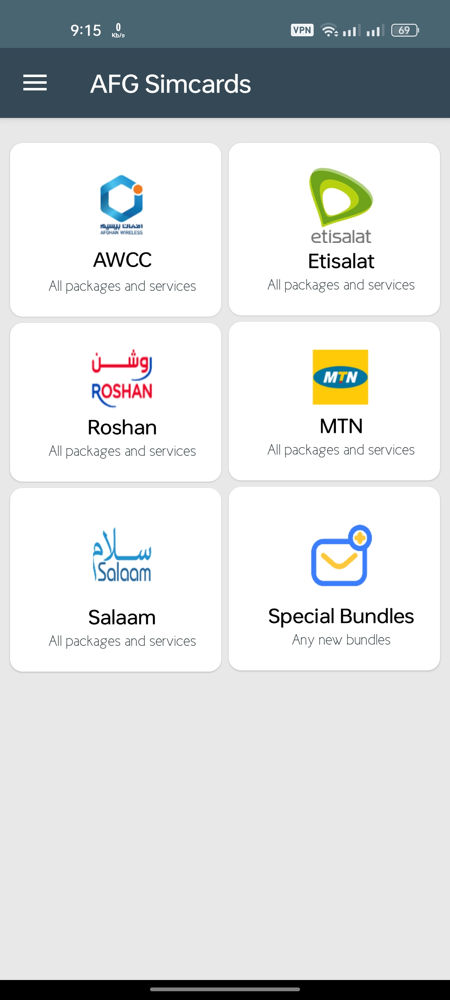
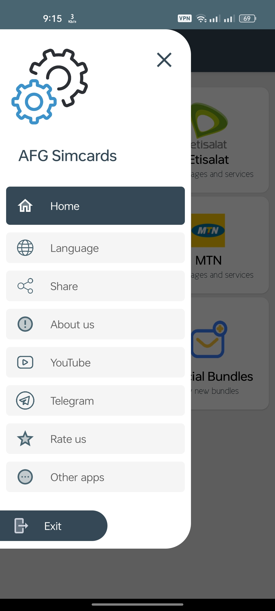
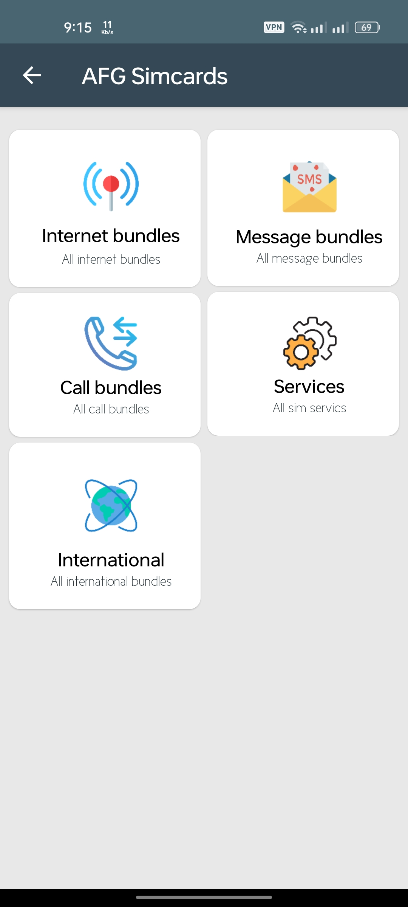
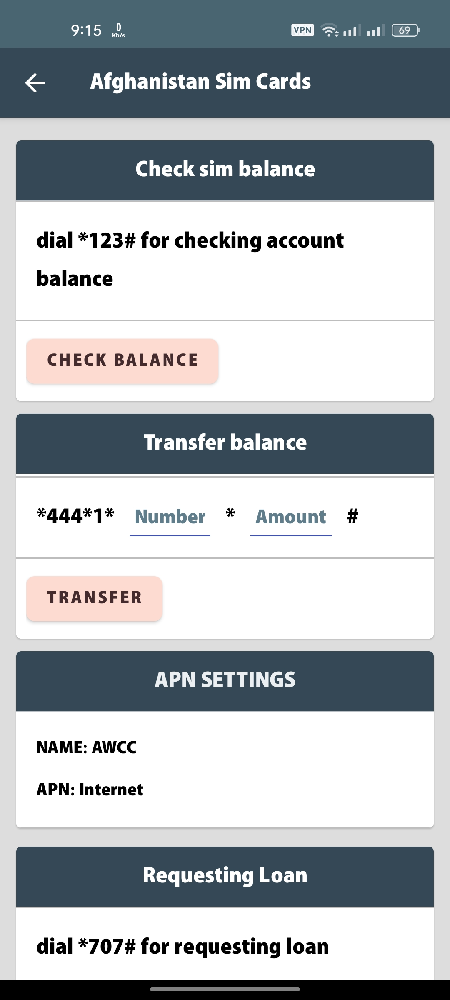

# SimCard Services App

SimCard Services App is an Android application that provides a comprehensive interface for managing and accessing various services offered by sim card providers. With this app, users can easily view and utilize services such as internet packages, SMS, calls, international calling, money transfers, balance checks, and more.

## Features

- **Internet Packages:** Browse and select from a wide range of available internet packages provided by different sim card operators.
- **SMS:** Send and receive SMS messages conveniently within the app, ensuring seamless communication.
- **Calls:** Make calls using the app, providing a hassle-free alternative to the standard dialer.
- **International Calling:** Enable international calling services and enjoy competitive rates for international calls.
-  gateways.
- **Balance Check:** Easily check the balance of your sim card, ensuring you stay updated on your account status.
- **Top-Up:** Add money to your sim card balance using various payment options available through the app.
- **Service Reminders:** Get reminders for package renewals, bill payments, and other important service-related events.

## Screenshots

## Installation

1. Clone the repository: `git clone https://github.com/Mohammad-Azizi/SIM_Service_Manager.git`
2. Open the project in Android Studio.
3. Build and run the app on an Android device or emulator.

## Dependencies

The SimCard Services App relies on the following dependencies:

- AndroidX Libraries
- Retrofit
- Gson
- Picasso

Please ensure that these dependencies are properly configured in your project's `build.gradle` file to ensure smooth integration and functionality.

## Contributions

Contributions to the SimCard Services App are welcome! If you encounter any issues or have suggestions for improvements, please feel free to submit a pull request. Your contributions will help enhance the app's features and overall user experience.

## License

This project is licensed under the Apache License. By contributing to this project, you agree to comply with the terms and conditions outlined in the license.

We appreciate your interest and support in the SimCard Services App. Together, we can create a robust and user-friendly platform for managing sim card services efficiently.
