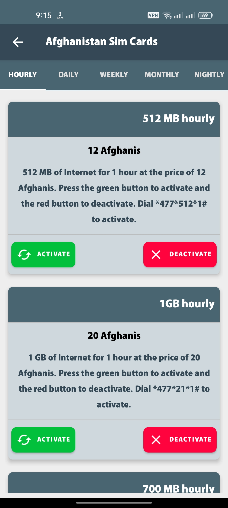

# SimCard Services App

SimCard Services App is an Android application that provides a comprehensive interface for managing and accessing various services offered by sim card providers. With this app, users can easily view and utilize services such as internet packages, SMS, calls, international calling, money transfers, balance checks, and more.

## Features

- **Code Reference:** Access a comprehensive collection of activation, deactivation, and other codes for various services offered by Afghan sim card operators.
- **Service Activation:** Find codes and instructions to activate specific services such as internet packages, SMS plans, and voice call bundles.
- **Service Deactivation:** Discover codes and guidelines to deactivate services that are no longer needed or to unsubscribe from specific offers.
- **Balance Check:** Access codes to check the balance of your Afghan sim card, ensuring you stay informed about your available credit or data usage.
- **Money Transfer Codes:** Explore codes for sending money to the same sim card or initiating mobile money transfers using available services.
- **Customer Support:** Find contact information for customer support services provided by Afghan sim card operators to address any queries or concerns.

- ## Screenshots

## Installation

1. Clone the repository: `git clone https://github.com/Mohammad-Azizi/SIM_Service_Manager.git`
2. Open the project in Android Studio.
3. Build and run the app on an Android device or emulator.

## Dependencies

The SimCard Services App relies on the following dependencies:

- AndroidX Libraries
  -  androidx.appcompat:appcompat
  -  com.google.android.material:material
  -  com.google.firebase:firebase-database
  -  com.google.firebase:firebase-storage
  -  com.google.android.gms:play-services-ads
  -  com.github.bumptech.glide:glide
  -  com.google.code.gson:gson
  -  com.airbnb.android:lottie
  -  com.squareup.okhttp3:okhttp
  -  com.sdsmdg.tastytoast:tastytoast
  -  com.facebook.shimmer:shimmer
  -  io.github.shashank02051997:FancyToast
  -  androidx.work:work-runtime
  -  androidx.multidex:multidex
  
Please ensure that these dependencies are properly configured in your project's `build.gradle` file to ensure smooth integration and functionality.

## Contributions

Contributions to the SimCard Services App are welcome! If you encounter any issues or have suggestions for improvements, please feel free to submit a pull request. Your contributions will help enhance the app's features and overall user experience.

## License

This project is licensed under the Apache License. By contributing to this project, you agree to comply with the terms and conditions outlined in the license.

We appreciate your interest and support in the SimCard Services App. Together, we can create a robust and user-friendly platform for managing sim card services efficiently.
